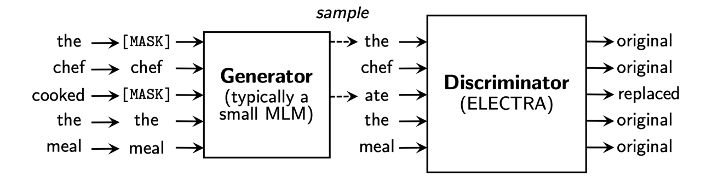

# ELECTRA

생성 일시: 2022년 12월 18일 오후 7:35
진행: 진행
태그: class

- ELECTRA는 기존 BERT를 비롯한 많은 language model들이 입력을 마스크 토큰으로 치환하고 이를 치환 전의 원본 토큰으로 복원하는 MLM을 사용했던 데에 반해
- RTD (Replaced Token Detection) 이라는 새로운 pre-training obejctive를 제안하여 학습 효율을 향상시킨 LM이다.

---

## ELECTRA github 공식 코드 ‘run_pretraining.py’ 코드 리뷰

### **1) Mask the input**

- generator의 input으로 들어갈 input에 마스킹을 진행하는 단계

- unmasked_input을 만든 다음 input에 대한 masking을 진행

- unmaksed_input을 만드는 features_to_inputs 함수

- 들어온 input에 대해서 tokenizer로 input_ids/input_mask/segment_ids를 뽑은 것을 dictionary 형태로 저장

- input을 mask하는 함수

- candidates_mask : mask 될 수 있는 인덱스의 갑시 1인 텐서
- num_to_predict : 하나의 example 당 mask할 토큰의 수
- maksed_lm_weights : 최대 N개 중 몇개를  mask할 것인지, mask할 개수의 인덱스 만큼 1.0
    - 과거에 mask 되었던 토큰은 제외해서 구함

- sample_prob : mask가 될 수 있는 토큰들의 합으로 나누어, 각각 sample이 될 확률을 계산
- masekd_lm_position: 샘플링이 될 로그 취한 확률값을 기반으로 mask가 될 index를 추출

- flat_positions : batch를 flat하게 펼쳤을 때의 position
- masked_lm_ids: mask token의 원래 index를 input_ids에서 가져오기

- N개 중 0인 index를 ignore하게 업데이트

- 최종적으로 masking된 input에 대한 예시

### 2) Generator

- [MASK] 토큰을 예측하는 generator 단계

- embedding size는 기본으로 bert의 hidden size인 768을 사용

**(1) generator - build transformer**

- generator는 BERT의 MLM과 동일함 → 따라서 BertModel을 generator로 build

- build_transformer 함수를 들어가보면 BertModel을 generator로 build하는 것을 확인할 수 있음

**(2) MLM output**

- mlm_output은 vocab 토큰들에 대해서 [MASK]토큰 자리에 들어가게 될 확률을 softmax output의 형태로 반환

- relevant_reprs : [MASK] 토큰 위치에 문맥이 반영된 dense representation 반환
- logits: 해당 representationㅇ르 기반으로 vocab의 토큰 중 채워질 확률이 높은 토큰을 표현하는 logit값 반환
- get_softmax_output: vocab size 크기의 softmax output 반환

- relevant_reprs를 반환하는 gather_positions 함수
  
    
    
    - 즉, 전체 seq_len의 벡터들 중 [MASK] 부분에 해당하는 벡터들만 뽑아서 반환하는 함수
    
    
    
- logits을 반환하는 get_token_logits 함수
  
    
    
    - 해당 representation을 기반으로 vocab의 토큰 중 채워질 확률이 가장 높은 토큰 logit값을 반환

- get_softmax_output 함수
  
    
    
    - probs는 logit에 softmax를 취한 값 (아래 수식과 같음)
      
        
        
    - label_log_probs는 loss를 계산하는 텀 (아래 수식과 같음)
      
        
        

**(3) fake_data**

- MLM 결과와 그 토큰이 진짜인지, 가짜인지 확인한 것을 return

- fake_data를 반환하는 get_fake_data 함수
  
    
    
    - unmask(inputs) : [MASK]가 복원된 original input
    - disallow
        - 각 위치에 대한 정답 토큰
        - config.disallow_correct=True이면 generator가 MASK 토큰에 대해서 일부러 fake한 정답을 생성하게끔 한다.
    - sampled_tokens
        - logit 값과 temperature를 조절하여 softmax값으로부터 token을 smaple
    - sampled_tokids: sample된 token id

- labels: updated_input과 실제 input이 틀릴 경우 1, 같을 경우 0을 label로 반환
- 최종적으로 1) updated된 input 2) fake_token인지 여부 3) sampled된 토큰을 반환

**(4) output**

- self.mlm_output과 self.total_loss를 통해서 최종적으로 mlm_output (softmax output)과 generator total loss를 반환한다.
- total loss의 두 가지 term 중 앞 쪽 을 return하여 반영한다고 볼 수 있음
  
    
    

### 3) Discriminator

**(1) build_transformer**

- discriminator도 transformer encoder network (BERT)를 사용한다.

**(2) get_discriminator_output**

- input으로는 (batch_size, seq_length, hidden_size) 를 받고
- output으로는 최종적으로 dimension 1의 logits 값을 주게 된다.

- weights: sequence 중에서 padding이 아닌 토큰들을 골라냄
- labelsf: is_fake_tokens의 값이 리턴되고, fake이면 1, real이면 0이 된다.
- losses: logit값과 label을 비교하여 sigmoid cross_entory_loss를 계산한다.
- probs: 하나의 example 당 logtis을 x추긍로 했을 때의 sigmoid 함수를 적용한 y갑승로 0에서 1 사이의 값을 갖게 된다.
- preds: logits을 이용한 label값으로, real인지 fake인지를 예측한다.

(3) output

- 최종적으로 disc_output (softmax output)과 discriminator total loss를 반환하여 total loss에 반영한다.
- 아래의 total loss 수식에서 두 번째 term에 반영된다.
  
    